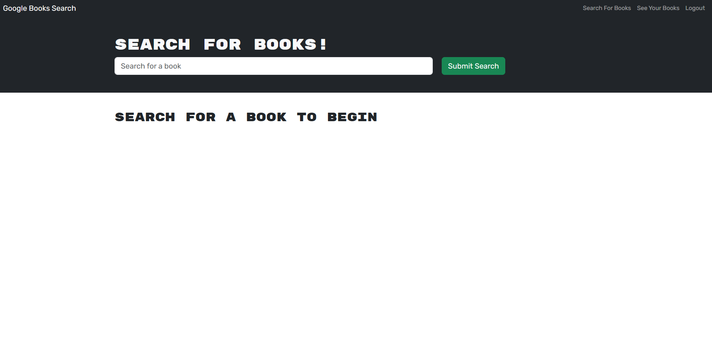

# Mern-Book-Search

## Description

A simple book search and saving app built using the MERN (Mongo, Express, React, Node.js) tech stack and graphql.

## Installation

Clone the repository, in your teriminal run `npm i` then run `npm run build` and finally run `npm run start` to start the application. Navigate to localhost:3000/ in your browser to view the webpage locally.

## Screenshot + Deployed App

[Link to deployed app](https://mern-book-search-8cci.onrender.com/)

## License

N/A
